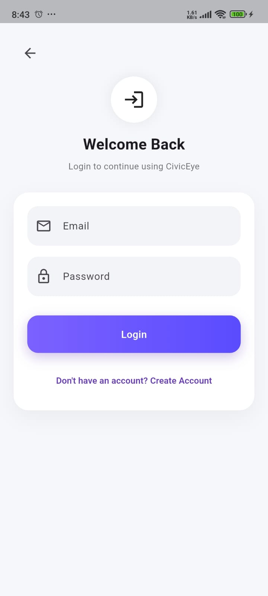
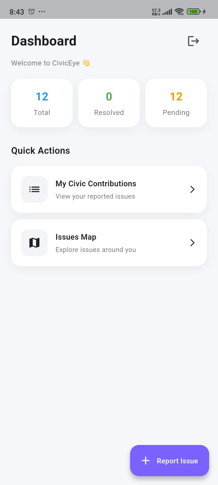
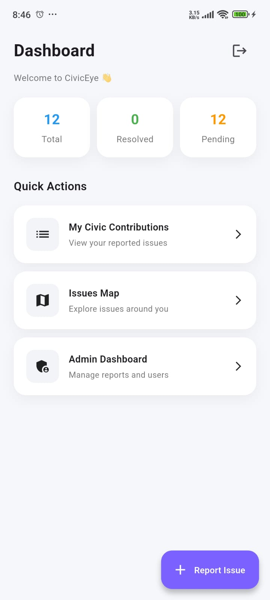
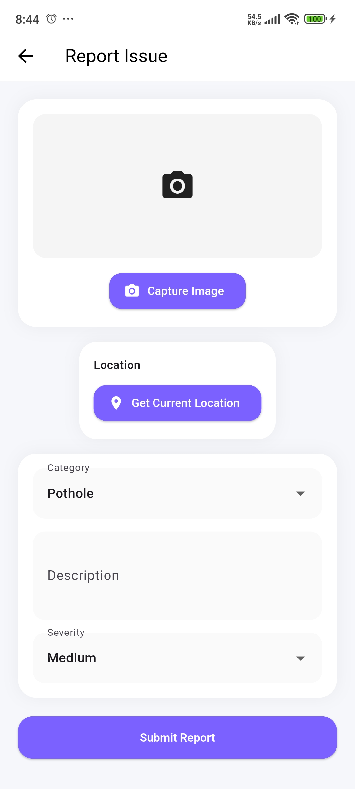
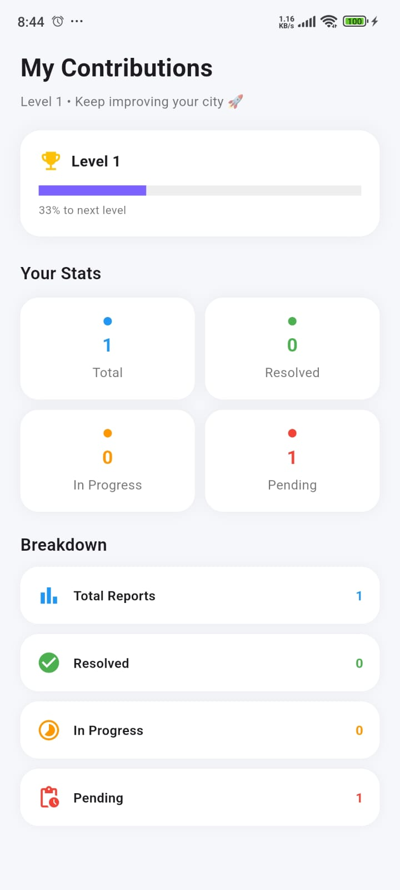
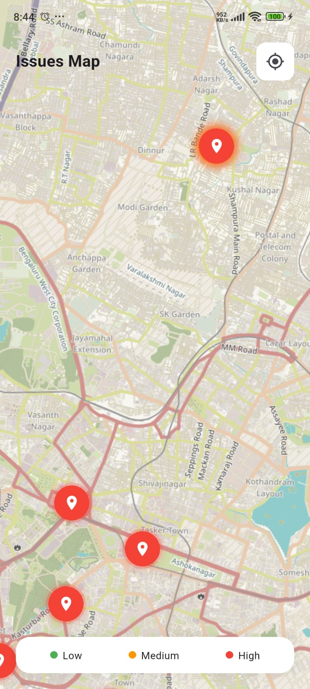
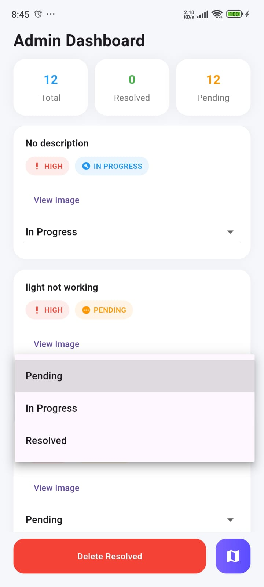
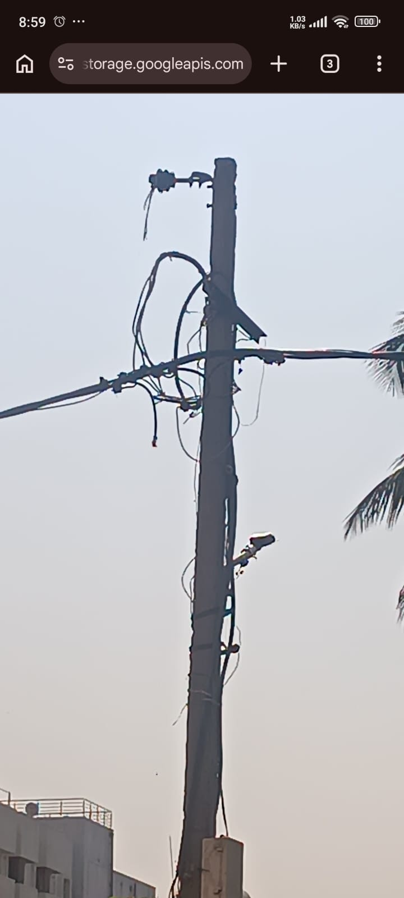

# CivicEye 🚧

CivicEye is a Flutter + Firebase based mobile application that allows citizens to report civic issues such as potholes, garbage, water leaks, and road damage.

---

## 📸 Screenshots

## 📱 Features

- User Authentication (Firebase)
- Report civic issues
- Location-based reporting
- Admin dashboard
- Issue status tracking

---

## 🛠 Tech Stack

- Flutter (Dart)
- Firebase Authentication
- Cloud Firestore
- Firebase Storage (optional)

---

## ⚠️ Important Note

Firebase configuration files are NOT included in this repository for security reasons.

---

## 🔥 Firebase Setup (Required)

To run this project, follow these steps:

### 1. Create Firebase Project
Go to:
https://console.firebase.google.com

Click **"Add Project"**

---

### 2. Add Android App

- Package name: com.example.civiceye

---

### 3. Download Config File

Download: google-services.json

Place it inside: android/app/

---

### 4. Install FlutterFire CLI

Run:

dart pub global activate flutterfire_cli

### 5. Configure Firebase

Run:

flutterfire configure

### 6. Run the App
flutter run

### 👨‍💻 Developed By

Prajwal M

